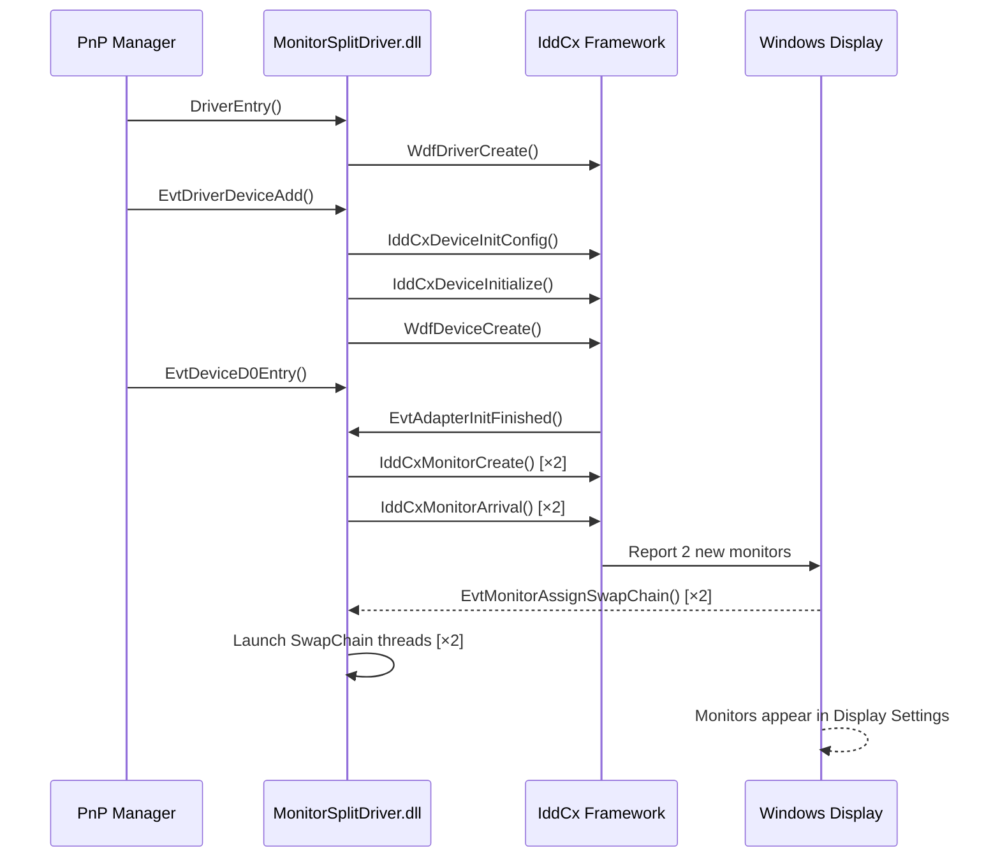
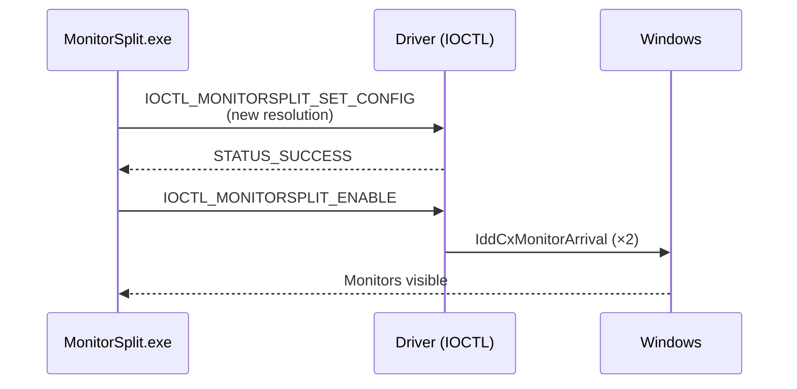

# Architecture — MonitorSplit

## System Overview

MonitorSplit consists of two cooperating components that together make Windows believe a single physical display is actually two independent monitors.

```
┌─────────────────────────────────────────────────────────────────────┐
│                        USER APPLICATIONS                            │
│   (OBS, games, browsers — they see 2 independent monitors)          │
└───────────────────────┬────────────────────────────┬────────────────┘
                        │                            │
              Virtual Monitor 1              Virtual Monitor 2
              (e.g. 960×1080)               (e.g. 960×1080)
                        │                            │
┌───────────────────────▼────────────────────────────▼────────────────┐
│              WINDOWS DISPLAY SUBSYSTEM (Win32k / DWM)               │
│  Desktop Window Manager composes windows onto each virtual display  │
└───────────────────────────────┬─────────────────────────────────────┘
                                │ IddCx interface
┌───────────────────────────────▼─────────────────────────────────────┐
│              MonitorSplitDriver.dll  (UMDF2 / IddCx)                │
│                                                                     │
│  ┌─────────────────────────────────────────────────────────────┐   │
│  │  IDD Adapter (virtual GPU)                                   │   │
│  │                                                             │   │
│  │  ┌──────────────────────┐  ┌──────────────────────────┐    │   │
│  │  │   Virtual Monitor 0  │  │   Virtual Monitor 1       │   │   │
│  │  │   (Left Half)        │  │   (Right Half)            │   │   │
│  │  │   EDID: MSP-0        │  │   EDID: MSP-1             │   │   │
│  │  │   Custom resolution  │  │   Custom resolution       │   │   │
│  │  │   SwapChain Thread ──┼──┼── SwapChain Thread        │   │   │
│  │  └──────────────────────┘  └──────────────────────────┘   │   │
│  └─────────────────────────────────────────────────────────────┘   │
│                          ▲                                          │
│                          │ DeviceIoControl (IOCTL)                  │
└──────────────────────────┼──────────────────────────────────────────┘
                           │
┌──────────────────────────▼──────────────────────────────────────────┐
│                    MonitorSplit.exe (WPF / .NET 8)                  │
│                                                                     │
│  ┌──────────────┐  ┌───────────────┐  ┌───────────────────────┐    │
│  │  DriverMgr   │  │ DisplayMgr    │  │  MainViewModel (MVVM) │    │
│  │  · Install   │  │ · Enumerate   │  │  · SplitRatio slider  │    │
│  │  · Uninstall │  │   physical    │  │  · Resolution fields  │    │
│  │  · IOCTL I/O │  │   monitors    │  │  · Enable/Disable     │    │
│  └──────┬───────┘  └───────────────┘  └───────────────────────┘    │
│         │                                        │                  │
│  ┌──────▼───────────────────────────────────────▼──────────┐       │
│  │                  MainWindow.xaml (WPF UI)                │       │
│  │  • Dark mode · Monitor preview · Split slider · Tray    │       │
│  └──────────────────────────────────────────────────────────┘       │
└─────────────────────────────────────────────────────────────────────┘
```

---

## Driver Lifecycle

### Initialization Flow



### IOCTL Communication Flow



---

## Component Details

### Driver Component (C++ / UMDF2)

| File | Responsibility |
|------|---------------|
| `MonitorSplitDriver.cpp` | WDF/IddCx lifecycle, IOCTL handler, SwapChain thread |
| `MonitorSplitDriver.h` | Types: `DEVICE_CONTEXT`, `MONITOR_CONTEXT`, `MONITORSPLIT_CONFIG`, IOCTL codes |
| `Edid.h` | Builds valid EDID 1.4 blocks (128 bytes) per virtual monitor |
| `Trace.h` | WPP tracing macros for ETW-based debugging |
| `MonitorSplitDriver.inf` | PnP installation descriptor, registry defaults |

**Key design decisions:**
- Uses **UMDF2** (User-Mode Driver Framework), not KMDF. This means the driver runs in user-mode — a crash cannot cause a BSOD.
- The SwapChain thread simply **acknowledges frames** without processing them. The OS compositor (DWM) handles the actual rendering to the virtual display surface.
- Configuration is stored both **in the driver registry** (persists across reboots) and communicated via IOCTL at runtime.

---

### App Component (C# / WPF / .NET 8)

```
MonitorSplit.exe
├── App.xaml.cs          ← Startup, DI container, NotifyIcon
├── MainWindow.xaml      ← UI shell (custom title bar, dark theme)
│
├── ViewModels/
│   └── MainViewModel    ← All UI logic (CommunityToolkit.Mvvm)
│       ├── Commands: Install, Uninstall, Enable, Disable, Apply, Refresh
│       └── Properties: Config, PhysicalMonitors, StatusMessage, ...
│
├── Services/
│   ├── DriverManager    ← P/Invoke: CreateFile, DeviceIoControl, pnputil
│   └── DisplayManager   ← P/Invoke: EnumDisplayMonitors, GetMonitorInfo
│
├── Models/
│   └── SplitConfig      ← Serializable configuration (JSON + IOCTL)
│
├── Themes/
│   ├── Colors.xaml      ← Design tokens (dark palette, accents)
│   └── Controls.xaml    ← Button, Slider, TextBox, Card styles
│
└── Converters/
    └── Converters.cs    ← InverseBool, NullToCollapsed, RatioToGridLength
```

**Technology choices:**
- **CommunityToolkit.Mvvm** for source-generated `[ObservableProperty]` and `[RelayCommand]` — reduces boilerplate by ~70%.
- **P/Invoke** for Win32 APIs (no COM interop, no WMI) — minimal dependencies.
- **System.Text.Json** for config persistence — built into .NET 8, zero extra packages.
- Config stored in `%APPDATA%\MonitorSplit\config.json` — survives app updates.

---

## Data Flow: Resolution Change

```
User moves slider (SplitRatioSlider)
        │
        ▼
MainViewModel.SplitRatioSlider setter
  → Config.SplitRatio = value / 100
  → Config.RecalculateFromPhysical()
        │
        ├──► Monitor preview columns update (GridLength binding)
        └──► "960 × 1080" labels update
        
User clicks "Apply Configuration"
        │
        ▼
ApplyConfigCommand
  → DriverManager.SendConfig(Config)
        │
        ▼
DeviceIoControl(IOCTL_MONITORSPLIT_SET_CONFIG, ...)
        │
        ▼
Driver receives new MONITORSPLIT_CONFIG
  → Stores in DEVICE_CONTEXT.Config
  (Resolution takes effect on next monitor reconnect / system restart)
```

---

## EDID Block Structure

Each virtual monitor reports a custom EDID (Extended Display Identification Data) 128-byte block to Windows. This is how Windows learns the monitor's resolution and timing parameters.

```
Byte  0- 7: Header (0x00 FF FF FF FF FF FF 0x00)
Byte  8- 9: Manufacturer ID ("MSP" encoded as 5-bit chars)
Byte 10-11: Product code (0x0001 for Monitor 1, 0x0002 for Monitor 2)
Byte 12-17: Serial number, week/year of manufacture
Byte 18-19: EDID version (1.4)
Byte 20-24: Digital input, 8bpc, DisplayPort, gamma=2.2
Byte 25-34: sRGB chromaticity coordinates
Byte 35-37: Established timings (none — we use DTD)
Byte 38-53: Standard timing info (unused, 0x01 0x01)
Byte 54-71: Detailed Timing Descriptor 1 (primary resolution)
Byte 72-89: Monitor Name descriptor (tag 0xFC) "MSplit-Left" / "MSplit-Right"
Byte 90-107: Range Limits descriptor (tag 0xFD) 48-75Hz, 30-135kHz
Byte 108-125: Dummy descriptor (tag 0x10)
Byte    126: Extension block count (0)
Byte    127: Checksum (makes sum of all bytes = 0 mod 256)
```

---

## Security Considerations

| Risk | Mitigation |
|------|-----------|
| Unsigned driver loading | Test Signing mode (dev only). Production: EV cert + WHQL |
| IOCTL from arbitrary process | Driver could add caller PID validation in IOCTL handler |
| Driver crash | UMDF2 is user-mode — crash restarts the driver host, no BSOD |
| GPU driver conflicts | Uninstall before GPU driver updates (documented in README) |
| Privilege escalation | App requires admin only for install/uninstall. Runtime IOCTL needs no elevation |
